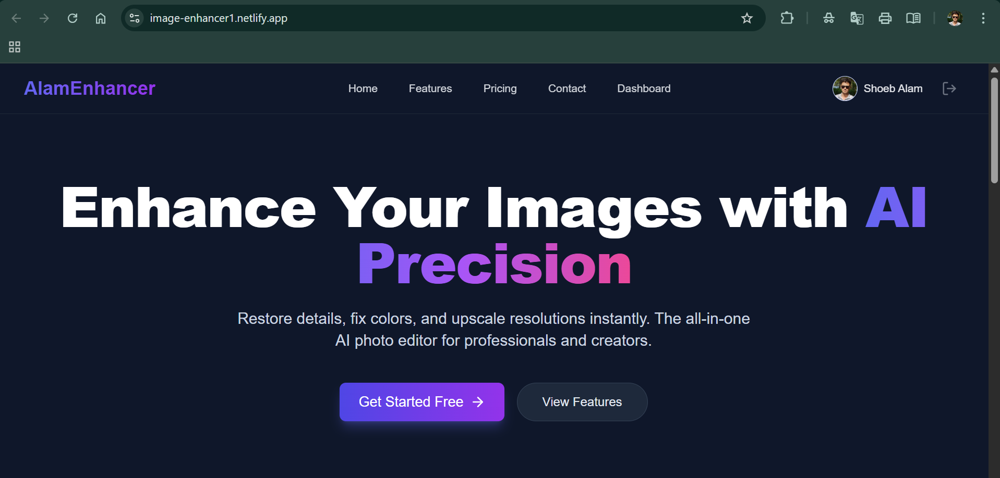

# Alam Image Enhancer 🎨✨

A powerful, full-stack web application for enhancing images using AI-powered tools. Built with the MERN stack (MongoDB, Express.js, React, Node.js) and integrated with Cloudinary for image processing.



## 🚀 Live Demo

- **Frontend (Netlify):** [https://image-enhancer1.netlify.app](https://image-enhancer1.netlify.app)
- **Backend (Koyeb):** [https://chosen-halie-fiveminor-1606349a.koyeb.app](https://chosen-halie-fiveminor-1606349a.koyeb.app)

## ✨ Features

- **User Authentication**: Secure Sign Up, Login, and **Google OAuth** integration.
- **Image Enhancement**: Upload and enhance images with various filters and adjustments.
- **Dashboard**: personalized user dashboard to manage enhanced images.
- **Responsive Design**: Modern, responsive UI built with Tailwind CSS and Framer Motion.
- **Dark/Light Mode**: User preference support (currently optimized for modern aesthetics).
- **History Tracker**: Keep track of your previous enhancements.
- **Secure Storage**: Images are processed and stored securely using Cloudinary.

## 🛠️ Tech Stack

### Frontend
- **React.js**: UI Library
- **Vite**: Build Tool
- **Tailwind CSS**: Styling
- **Framer Motion**: Animations
- **Lucide React**: Icons
- **Axios**: API Requests
- **React Router DOM**: Navigation

### Backend
- **Node.js**: Runtime Environment
- **Express.js**: Web Framework
- **MongoDB**: NoSQL Database
- **Mongoose**: ODM
- **Passport.js**: Authentication (JWT & Google OAuth)
- **Cloudinary**: Image Management
- **Multer**: File Uploads

## ⚙️ Installation & Setup (Local)

Follow these steps to run the project locally.

### Prerequisites
- Node.js installed
- MongoDB installed (or Atlas URI)
- Cloudinary Account
- Google Cloud Console Project (for OAuth)

### 1. Clone the Repository
```bash
git clone https://github.com/yourusername/alam-image-enhancer.git
cd alam-image-enhancer
```

### 2. Backend Setup
```bash
cd backend
npm install
```

Create a `.env` file in the `backend` folder:
```env
PORT=5000
MONGO_URI=your_mongodb_connection_string
JWT_SECRET=your_jwt_secret
GOOGLE_CLIENT_ID=your_google_client_id
GOOGLE_CLIENT_SECRET=your_google_client_secret
CLOUDINARY_CLOUD_NAME=your_cloud_name
CLOUDINARY_API_KEY=your_api_key
CLOUDINARY_API_SECRET=your_api_secret
FRONTEND_URL=http://localhost:5173
```

Run the backend:
```bash
npm run dev
```

### 3. Frontend Setup
Open a new terminal and navigate to the frontend folder:
```bash
cd frontend
npm install
```

Create a `.env` file in the `frontend` folder:
```env
VITE_API_URL=http://localhost:5000/api
```

Run the frontend:
```bash
npm run dev
```

Visit `http://localhost:5173` in your browser.

## 🚀 Deployment

### Backend (Koyeb/Render)
- Connect your GitHub repo.
- Set Build Command: `npm install`
- Set Start Command: `node server.js`
- Add all environment variables from `backend/.env`.

### Frontend (Netlify)
- Connect your GitHub repo.
- Set Build Command: `npm run build`
- Set Publish Directory: `dist`
- Add Environment Variable: `VITE_API_URL` (Your deployed Backend URL).

## 📄 License

This project is licensed under the MIT License.

---
**Developed by Shoeb Alam** 💻
